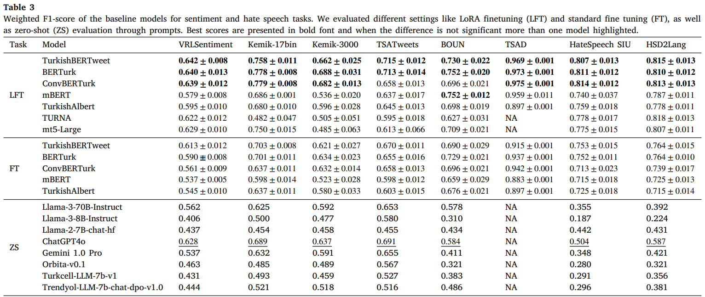

#### Table of contents
1. [Introduction](#introduction)
2. [Main results](#results)
3. [Using TurkishBERTweet with `transformers`](#transformers)
    - [Model](#trainedModels)
    - [Lora Adapter]($loraAdapter)    
    - [Example usage](#usage2)
        - [Twitter Preprocessor](#preprocess)
        - [Feature Extraction](#feature_extraction)
        - [Sentiment Classification](#sa_lora)
        - [HateSpeech Detection](#hs_lora)

4. [Citation](#citation)
# <a name="introduction"></a> TurkishBERTweet: Fast and Reliable Large Language Model for Social Media Analysis


# <a name="results"></a> Main Results



<!-- https://huggingface.co/VRLLab/TurkishBERTweet -->
# <a name="trainedModels"></a> Model
Model | #params | Arch. | Max length | Pre-training data
---|---|---|---|---
[`VRLLab/TurkishBERTweet`](https://huggingface.co/VRLLab/TurkishBERTweet) | 163M | base | 128 | 894M Turkish Tweets (uncased)

# <a name="loraAdapter"></a> Lora Adapters
Model | train f1 | dev f1 | test f1 | Dataset Size
---|---|---|---|---
[`VRLLab/TurkishBERTweet-Lora-SA`](https://huggingface.co/VRLLab/TurkishBERTweet-Lora-SA) | 0.799 | 0.687 | 0.692 | 42,476 Turkish Tweets  
[`VRLLab/TurkishBERTweet-Lora-HS`](https://huggingface.co/VRLLab/TurkishBERTweet-Lora-HS) | 0.915 | 0.796 | 0.831 | 4,683 Turkish Tweets  
# <a name="usage2"></a> Example usage

```bash
git clone git@github.com:ViralLab/TurkishBERTweet.git
cd TurkishBERTweet
python -m venv venv
source venv/bin/activate

pip install torch torchvision torchaudio --index-url https://download.pytorch.org/whl/cu118
pip install peft
pip install transformers
```


## <a name="preprocess"></a> Twitter Preprocessor
```python
from Preprocessor import preprocess

text = """Lab'ımıza "viral" adını verdik çünkü amacımız disiplinler arası sınırları aşmak ve aralarında yeni bağlantılar kurmak! 🔬 #ViralLab
https://varollab.com/"""

preprocessed_text = preprocess(text)
print(preprocessed_text)
```
Output:
```output
lab'ımıza "viral" adını verdik çünkü amacımız disiplinler arası sınırları aşmak ve aralarında yeni bağlantılar kurmak! <emoji> mikroskop </emoji> <hashtag> virallab </hashtag> <http> varollab.com </http>
```


## <a name="feature_extraction"></a> Feature Extraction

```python
import torch
from transformers import AutoTokenizer, AutoModel
from Preprocessor import preprocess

tokenizer = AutoTokenizer.from_pretrained("VRLLab/TurkishBERTweet")
turkishBERTweet = AutoModel.from_pretrained("VRLLab/TurkishBERTweet")

text = """Lab'ımıza "viral" adını verdik çünkü amacımız disiplinler arası sınırları aşmak ve aralarında yeni bağlantılar kurmak! 💥🔬 #ViralLab #DisiplinlerArası #YenilikçiBağlantılar"""

preprocessed_text = preprocess(text)
input_ids = torch.tensor([tokenizer.encode(preprocessed_text)])

with torch.no_grad():
    features = turkishBERTweet(input_ids)  # Models outputs are now tuples
```


## <a name="sa_lora"></a> Sentiment Classification

```python
import torch
from peft import (
    PeftModel,
    PeftConfig,
)

from transformers import (
    AutoModelForSequenceClassification,
    AutoTokenizer)
from Preprocessor import preprocess
 

peft_model = "VRLLab/TurkishBERTweet-Lora-SA"
peft_config = PeftConfig.from_pretrained(peft_model)

# loading Tokenizer
padding_side = "right"
tokenizer = AutoTokenizer.from_pretrained(
    peft_config.base_model_name_or_path, padding_side=padding_side
)
if getattr(tokenizer, "pad_token_id") is None:
    tokenizer.pad_token_id = tokenizer.eos_token_id

id2label_sa = {0: "negative", 2: "positive", 1: "neutral"}
turkishBERTweet_sa = AutoModelForSequenceClassification.from_pretrained(
    peft_config.base_model_name_or_path, return_dict=True, num_labels=len(id2label_sa), id2label=id2label_sa
)
turkishBERTweet_sa = PeftModel.from_pretrained(turkishBERTweet_sa, peft_model)

sample_texts = [
    "Viral lab da insanlar hep birlikte çalışıyorlar. hepbirlikte çalışan insanlar birbirlerine yakın oluyorlar.",     
    "americanin diplatlari turkiyeye gelmesin 😤",
    "Mark Zuckerberg ve Elon Musk'un boks müsabakası süper olacak! 🥷",
    "Adam dun ne yediğini unuttu"
    ]


preprocessed_texts = [preprocess(s) for s in sample_texts]
with torch.no_grad():
    for s in preprocessed_texts:
        ids = tokenizer.encode_plus(s, return_tensors="pt")
        label_id = turkishBERTweet_sa(**ids).logits.argmax(-1).item()
        print(id2label_sa[label_id],":", s)
```

```output
positive : viral lab da insanlar hep birlikte çalışıyorlar. hepbirlikte çalışan insanlar birbirlerine yakın oluyorlar.
negative : americanin diplatlari turkiyeye gelmesin <emoji> burundan_buharla_yüzleşmek </emoji>
positive : mark zuckerberg ve elon musk'un boks müsabakası süper olacak! <emoji> kadın_muhafız_koyu_ten_tonu </emoji>
neutral : adam dun ne yediğini unuttu
```
## <a name="hs_lora"></a> HateSpeech Detection
```python
from peft import (
    PeftModel,
    PeftConfig,
)

from transformers import (
    AutoModelForSequenceClassification,
    AutoTokenizer)
from Preprocessor import preprocess
 

peft_model = "VRLLab/TurkishBERTweet-Lora-HS"
peft_config = PeftConfig.from_pretrained(peft_model)

# loading Tokenizer
padding_side = "right"
tokenizer = AutoTokenizer.from_pretrained(
    peft_config.base_model_name_or_path, padding_side=padding_side
)
if getattr(tokenizer, "pad_token_id") is None:
    tokenizer.pad_token_id = tokenizer.eos_token_id

id2label_hs = {0: "No", 1: "Yes"}
turkishBERTweet_hs = AutoModelForSequenceClassification.from_pretrained(
    peft_config.base_model_name_or_path, return_dict=True, num_labels=len(id2label_hs), id2label=id2label_hs
)
turkishBERTweet_hs = PeftModel.from_pretrained(turkishBERTweet_hs, peft_model)


sample_texts = [
    "Viral lab da insanlar hep birlikte çalışıyorlar. hepbirlikte çalışan insanlar birbirlerine yakın oluyorlar.",     
    "kasmayin artik ya kac kere tanik olduk bu azgin tehlikeli \u201cmultecilerin\u201d yaptiklarina? bir afgan taragindan kafasi tasla ezilip tecavuz edilen kiza da git boyle cihangir solculugu yap yerse?",
    ]


preprocessed_texts = [preprocess(s) for s in sample_texts]
with torch.no_grad():
    for s in preprocessed_texts:
        ids = tokenizer.encode_plus(s, return_tensors="pt")
        label_id = best_model_hs(**ids).logits.argmax(-1).item()
        print(id2label_hs[label_id],":", s)
```

```output
No : viral lab da insanlar hep birlikte çalışıyorlar. hepbirlikte çalışan insanlar birbirlerine yakın oluyorlar.
Yes : kasmayin artik ya kac kere tanik olduk bu azgin tehlikeli “multecilerin” yaptiklarina? bir afgan taragindan kafasi tasla ezilip tecavuz edilen kiza da git boyle cihangir solculugu yap yerse?

```
 

# <a name="citation"></a> Citation
```bibtex
@article{najafi2022TurkishBERTweet,
    title={TurkishBERTweet: Fast and Reliable Large Language Model for Social Media Analysis},
    author={Najafi, Ali and Varol, Onur},
    journal={arXiv preprint 2311.18063},
    year={2023}
}
```


## Acknowledgments
We thank [Fatih Amasyali](https://avesis.yildiz.edu.tr/amasyali) for providing access to Tweet Sentiment datasets from Kemik group.
This material is based upon work supported by the Google Cloud Research Credits program with the award GCP19980904. We also thank TUBITAK (121C220 and 222N311) for funding this project. 
